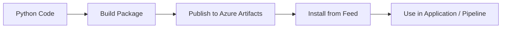

# azure-artifacts-python-helloworld
06-12-2025

**Azure DevOps Pipeline + Azure Artifacts project** for a **Basic Python Hello World** application.

✔ Basic Python code
✔ Requirements + setup
✔ Azure Artifacts feed usage (publish + restore)
✔ azure-pipelines.yml (CI pipeline)
✔ README.md (full documentation + diagrams)

---

# 📁 **Project Structure**

```
azure-artifacts-python-hello-world/
│── app/
│    ├── __init__.py
│    ├── hello.py
│── dist/               # Auto-generated - package files
│── setup.py            # Packaging config
│── requirements.txt
│── azure-pipelines.yml
│── README.md
```

---

# 🐍 **Basic Python Hello World Code**

### **app/hello.py**

```python
def say_hello(name="Azure Artifacts"):
    return f"Hello from {name}!"

if __name__ == "__main__":
    print(say_hello())
```

---

# ⚙️ **setup.py for Publishing to Azure Artifacts**

```python
from setuptools import setup, find_packages

setup(
    name="azurehello",
    version="1.0.0",
    packages=find_packages(),
    install_requires=[],
    author="Atul",
    description="Basic Python Hello World package published to Azure Artifacts",
)
```

---

# 📦 **requirements.txt**

```
azurehello @ file:./dist
```

---

# 🚀 **Azure Pipelines CI (Build & Publish Package to Azure Artifacts)**

### **azure-pipelines.yml**

```yaml
trigger:
  - main

pool:
  vmImage: 'ubuntu-latest'

steps:

# Step 1: Install Python
- task: UsePythonVersion@0
  inputs:
    versionSpec: '3.x'
  displayName: "Use Python 3.x"

# Step 2: Install setuptools + wheel + twine
- script: |
    pip install setuptools wheel twine
  displayName: "Install packaging tools"

# Step 3: Build Python package
- script: |
    python setup.py sdist bdist_wheel
  displayName: "Build Python package"

# Step 4: Publish Python package to Azure Artifacts
- task: TwineAuthenticate@1
  inputs:
    artifactFeed: "your-feed-name"
  displayName: "Authenticate with Azure Artifacts"

- script: |
    python -m twine upload -r "your-feed-name" --config-file $(PYPIRC_PATH) dist/*
  displayName: "Upload package to Azure Artifacts"

# Step 5: Install package from Azure Artifacts (test)
- script: |
    pip install azurehello --extra-index-url $(feed.url)
    python -c "import app.hello as h; print(h.say_hello('Pipeline Test'))"
  displayName: "Install & test package"
```

---

# 🖼️ **Architecture Diagram**


---

# 📘 **README.md (Complete Documentation)**

````md
# Azure Artifacts – Python Hello World Project

This project demonstrates how to:

✔ Build a Python package  
✔ Publish it to **Azure Artifacts**  
✔ Restore and use the package inside an Azure Pipeline  

---

## 📁 Folder Structure
```
app/
  hello.py
setup.py
requirements.txt
azure-pipelines.yml
```

---

## 🚀 Running Locally

### 1️⃣ Create virtual environment
```bash
python3 -m venv venv
source venv/bin/activate
```

### 2️⃣ Install locally
```bash
python setup.py sdist bdist_wheel
pip install dist/azurehello-1.0.0-py3-none-any.whl
```

### 3️⃣ Run
```bash
python -m app.hello
```

---

## 🧪 Testing the Function

```python
import app.hello as h
print(h.say_hello("Azure DevOps"))
```

---

## 📦 Publishing to Azure Artifacts

1. Go to Azure DevOps → Artifacts → Create Feed  
2. Add permission: Read + Write  
3. Update pipeline with your feed name  
4. Run pipeline → package is uploaded into Azure Artifacts  

---

## 🔄 Installing Package from Azure Artifacts

Add the feed URL to pip:

```bash
pip install azurehello --extra-index-url https://pkgs.dev.azure.com/<ORG>/<PROJECT>/_packaging/<FEED>/pypi/simple/
```

---

## 📘 Pipeline Workflow Diagram



---

## 🏁 Summary

You now have:

- A Python Hello World package  
- Packaged using setup.py  
- CI pipeline that publishes to Azure Artifacts  
- Ability to restore & use package from Azure DevOps feeds  

````

---

